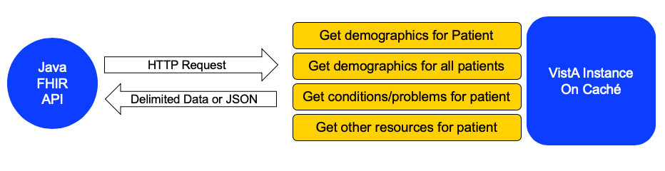

# FHIR-on-VistA #

This repository consists of two main components:

1. A VistA application which provides a REST API on top of VistA
2. A Java application that provides a FHIR API on top of the VistA application

Each is necessary to provide a FHIR API on top of an instance of VistA. 

The VistA REST API reads data from a VistA instance and returns data either as delimted text or as JSON. The Java FHIR API calls the VistA REST API and translates the delimited text or JSON into FHIR. Currently this Java FHIR API returns FHIR data as STU3.

## VistA REST API

## Java Application
The Java application provids a FHIR API using [Spring Boot](https://spring.io/projects/spring-boot) and the [Hapi FHIR framework](http://hapifhir.io/). 

Currently, the API provides the following FHIR resources:

* Patient
* Care Team
* Condition
* Observation
* Location

Within the Patient resource the following compartments are available:

* Condition
* Encounter
* Practitioner
* Observation
* Medication Statement
* Medication Dispense
* Medication Administration
* Composition
* Procedure
* Flag
* Appointment
* Allergy Intolerance
* Immunization
* Goal
* CarePlan
* Diagnostic Report

[Java API Implementation

## Long Term Goals

### VistA REST API
* More JSON endpoints, replacing text-delimited enpoints.
* More FHIR resource support
* Actual FHIR from endpoints

### Java
* STU 4
* Migrate to Java 11
* Junit 5
* More FHIR resources
* More JSON consumption, replacing text-delimited consumption.

