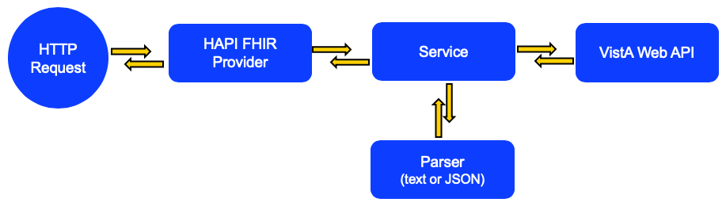

# FHIR API #

## Architecture ##

The applicaton has three layers for processing requests and communicating with the VistA REST API. The outer layer is dictated by [Hapi FHIR](http://hapifhir.io/), and is a [Resource Provider](http://hapifhir.io/doc_rest_server.html). The functionality of this layer is essentially to validate and translate any incoming parameters. This layer calls the service layer, which in turn calls the VistaData layer which communicates with the VistA REST API. Results obtained from VistA are then passed back to the service layer (as text or JSON depending on the API called) and parsed into FHIR objects. The FHIR objects are passed back to the Hapi FHIR resource provider and returned to the caller.

## Configuration ##
There are two configuration items in the project, located in `java-api/src/main/resources/application.properties`: 

* vistaUrl - The base URL to the VistA REST API
* serverUrl - The URL to this application (required by Hapi FHIR)

Additionally, requests are served out of the `/api` directory in the application URL. This is set in the `HcFhirServlet` class.

## Build and Run ##

The project uses Gradle for compiling and running tests. There is no need to install Gradle, the Gradle wrapper included in the repository is sufficient to compile and test the code. The first time the wrapper is executed it will download the correct version of Gradle into the project directory. This step varies slightly by platform. Execute the commands below to build, test, and run the code.

MacOS or Linux
	
~~~~
./gradlew clean build

java -jar build/libs/healthconcourse-vista-fhir-api-2.0.0.jar
~~~~

Windows
	
~~~~
gradlew.bat clean build

java -jar build/libs/healthconcourse-vista-fhir-api-2.0.0.jar
~~~~

Test the application by visiting [http://localhost:8080/api/metadata](http://localhost:8080/api/metadata)

## Docker ##

To build the docker container, run this:

~~~~
docker build -t osehra/fhir-on-vista .
~~~~

To run the application against the OSEHRA Demo Server, run this:

~~~~
docker run -d -p 2222:22 -p 8001:8001 -p 9430:9430 -p 9080:9080 --name vehu osehra/vehu
docker run --rm --name fhir-api --link vehu:vista -p 8080:8080 osehra/fhir-on-vista
~~~~

By default, it talks to a server located at "http://vista:9080/". If you want
it to talk to another server, you can override the properties using environment
variables. E.g.

~~~~
docker run --rm --name fhir-api -e VISTAURL='http://host.docker.internal:9080/' -p 8080:8080 -p 8000:8000 osehra/fhir-on-vista
~~~~

If the specific VistA instance doesn't have the KIDS builds already installed
that do the work, you will need to install them.
